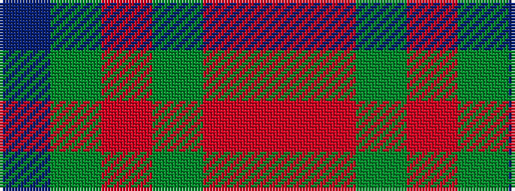

BGRGRR

It is a 6 stripe tartan.

<figure class="pat-woven">

<figcaption>idealised sample</figcaption>
</figure>

## Colour Sequence



## Tartans with this colour sequence

| Tartans |
|---------------|
| [Moray of Abercairney](/setts/s6/ri8r1g4r1g1t2~x2/)|
||
| [Moray of Abercairney](/setts/s6/r8ri1dg4ri1dg1t2~x2/)|
||
