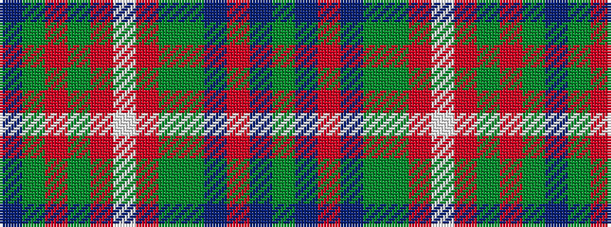

BGRGRWRGGBRBG

It is a 13 stripe tartan.

<figure class="pat-woven">

<figcaption>idealised sample</figcaption>
</figure>

## Colour Sequence



## Tartans with this colour sequence

| Tartans |
|---------------|
| [Mill o Forest Primary School (Corp)](/variants/s13/db3dg22r5dg5o5w1o1dg1g8db6o1db5dg2~x2/)|
||
