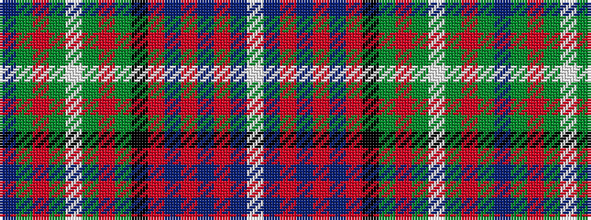

BGRGWGRGKRBRBRBW

It is a 16 stripe tartan.

<figure class="pat-woven">

<figcaption>idealised sample</figcaption>
</figure>

## Colour Sequence



## Tartans with this colour sequence

| Tartans |
|---------------|
| [Rankin](/setts/s16/db36dg10r2dg10w2dg10r2dg10k14r2db12r3db2r2db4w2~x2/)|
||
| [Rankin](/setts/s16/db36g10r2g10w2g10r2g10k14r2db12r3db2r2db4w2~x2/)|
||
| [Rankin (1998) (Name)](/setts/s16/db36g10r2g10lb2g10r2g10k14r2db12r3db2r2db4lb2~x2/)|
||
