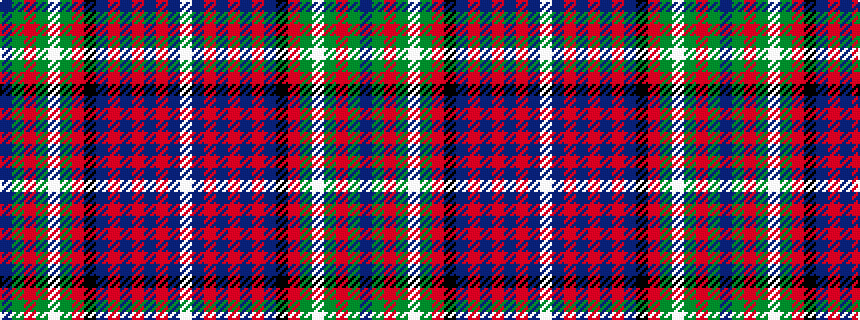

BGRGWGRKBRBRBRBW

It is a 16 stripe tartan.

<figure class="pat-woven">

<figcaption>idealised sample</figcaption>
</figure>

## Colour Sequence



## Tartans with this colour sequence

| Tartans |
|---------------|
| [Rankin](/variants/s16/db36g10r2g10w2g10r2k10db14r2db12r3db2r2db4w2~x2/)|
||
