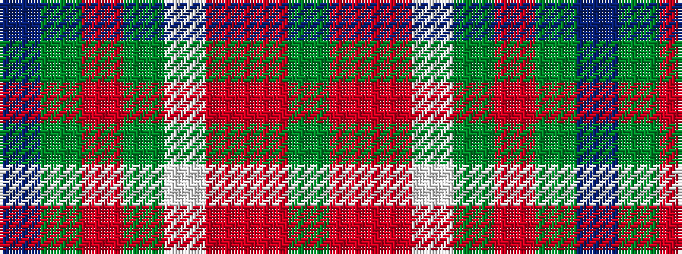

BGRGWRRG

It is a 8 stripe tartan.

<figure class="pat-woven">

<figcaption>idealised sample</figcaption>
</figure>

## Colour Sequence



## Tartans with this colour sequence

| Tartans |
|---------------|
| [Equorian Olympic](/variants/s8/db2y1o1dg6w3o3o1y1/)|
||
