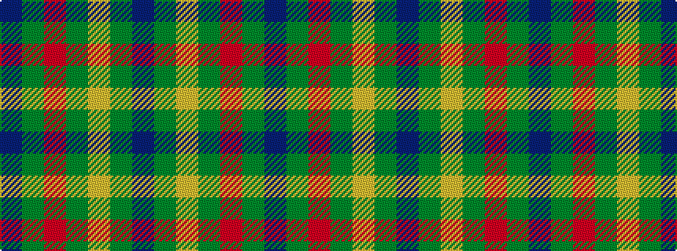

BGRGYGB

It is a 7 stripe tartan.

<figure class="pat-woven">

<figcaption>idealised sample</figcaption>
</figure>

## Colour Sequence



## Tartans with this colour sequence

| Tartans |
|---------------|
| [Justus Hunting (Personal)](/variants/s7/db1dg4r1dg1lo1dg4db1~x12/)|
||
| [Justus hunting](/variants/s7/db1g4r1g1ly1g4db1~x12/)|
||
