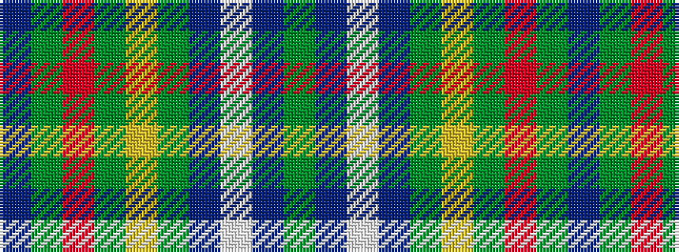

BGRGYGBWBG

It is a 10 stripe tartan.

<figure class="pat-woven">

<figcaption>idealised sample</figcaption>
</figure>

## Colour Sequence



## Tartans with this colour sequence

| Tartans |
|---------------|
| [Harkness](/variants/s10/g21db4w4db32g12ly4g8r4g6db12/)|
||
| [Harkness Htg (Name)](/variants/s10/g10n2w2n16g6ly2g4r2g3n6~x4/)|
||
| [Harkness Hunting](/variants/s10/dg21db4w4db32dg12ly4dg8r4dg6db12/)|
||
