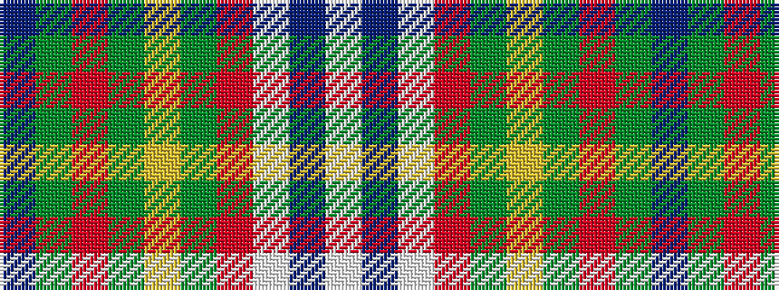

BGRGYGRWBW

It is a 10 stripe tartan.

<figure class="pat-woven">

<figcaption>idealised sample</figcaption>
</figure>

## Colour Sequence



## Tartans with this colour sequence

| Tartans |
|---------------|
| [Confederate Memorial](/setts/s10/t12y4r4y4ly2y48r16w1db4w3~x2/)|
||
