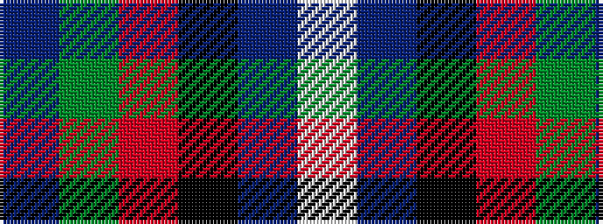

BGRKBW

It is a 6 stripe tartan.

<figure class="pat-woven">

<figcaption>idealised sample</figcaption>
</figure>

## Colour Sequence



## Tartans with this colour sequence

| Tartans |
|---------------|
| [Diaspora](/variants/s6/db3dg1r22k12db28lb3~x2/)|
||
| [Gamblin Thompson (Personal)](/variants/s6/t2g13r2k6db23w1~x4/)|
||
