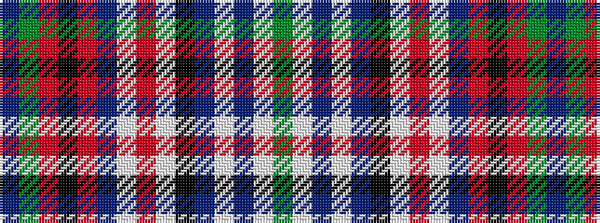

BGRKRBWRWKBWBWG

It is a 15 stripe tartan.

<figure class="pat-woven">

<figcaption>idealised sample</figcaption>
</figure>

## Colour Sequence



## Tartans with this colour sequence

| Tartans |
|---------------|
| [Gordon Red](/setts/s15/dg18w2db16w2t6k16w2r8w2db9r9k6r9dg6t6~x2/)|
||
| [Gordon, Red](/setts/s15/g18w2db16w2t6k16w2r8w2db9r9k6r9g6t6~x2/)|
||
