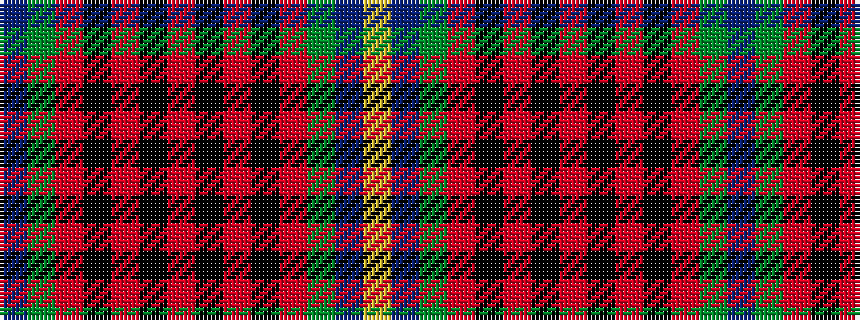

BGRKRKRKRKRGBY

It is a 14 stripe tartan.

<figure class="pat-woven">

<figcaption>idealised sample</figcaption>
</figure>

## Colour Sequence



## Tartans with this colour sequence

| Tartans |
|---------------|
| [Sikh Clan/Family Tartan Tartan Number: 2654. Earliest known date: 1999 Commissioned by a Mr A.J. Singh to celebrate the 50th anniversary of his family's arrival in Scotland. Can be worn by anyone of the Sikh faith. It was also to celebrate the 300th (??) anniversary of the founding of the Sikh religion that falls in the year Two Thousand. See products available Copyright © Blair Urquhart, Comrie, 2015](/setts/s14/dt20g20o3k4o3k4o30k4o3k4o3g20dt20ly4~x2/)|
||
