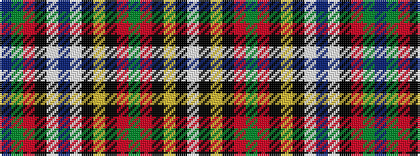

BGRKWBWKYKRGRKYKW

It is a 17 stripe tartan.

<figure class="pat-woven">

<figcaption>idealised sample</figcaption>
</figure>

## Colour Sequence



## Tartans with this colour sequence

| Tartans |
|---------------|
| [Wcwm 1572-2](/variants/s17/do4dg6r2k6lb2do4lb2k6ly1k2r2dg2r2k2ly1k6lb2~x4/)|
||
