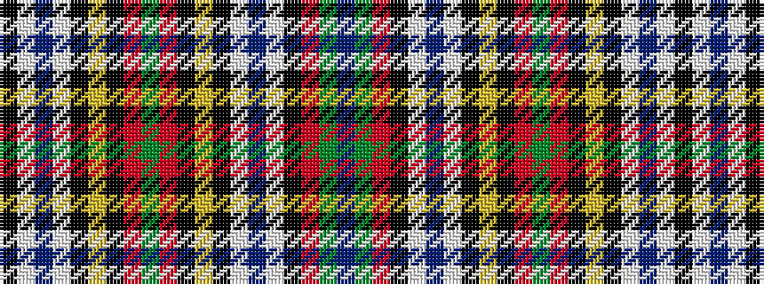

BGRKWBWKYKRGRKYKWBWK

It is a 20 stripe tartan.

<figure class="pat-woven">

<figcaption>idealised sample</figcaption>
</figure>

## Colour Sequence



## Tartans with this colour sequence

| Tartans |
|---------------|
| [Wcwm 9275-1572-2](/setts/s20/k112lb2do4lb2k6lo1k2r2g2r2k2lo1k6lb2do4lb2k6r2g6do4~x2/)|
||
