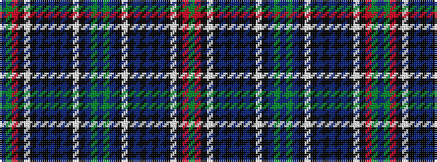

BGRKWKBKBKBKWKBGBGBKWKBKBKBKWKRG

It is a 32 stripe tartan.

<figure class="pat-woven">

<figcaption>idealised sample</figcaption>
</figure>

## Colour Sequence



## Tartans with this colour sequence

| Tartans |
|---------------|
| [Selkirk, New](/setts/s32/db24g2db12k2w2k3dp2k3b4k3dp2k3w2k2r12g2b24~x2/)|
||
