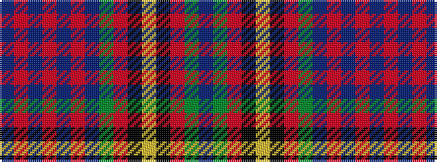

BGRKYKRGBRBRBRB

It is a 15 stripe tartan.

<figure class="pat-woven">

<figcaption>idealised sample</figcaption>
</figure>

## Colour Sequence



## Tartans with this colour sequence

| Tartans |
|---------------|
| [Mungall Family Tartan](/variants/s15/t30y8r2k8ly2k8r2y8db11r2t10r3t2r2db3~x2/)|
||
