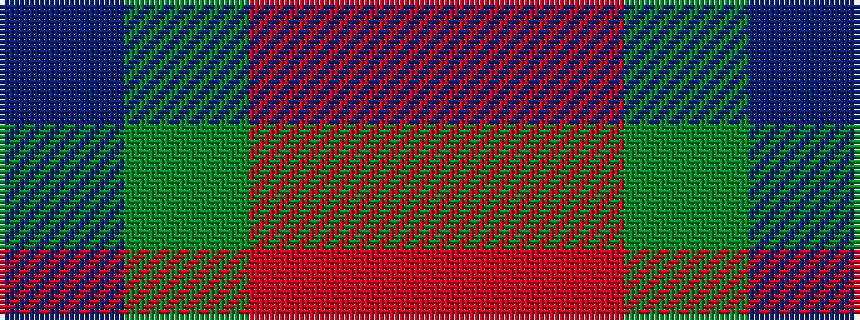

BGRR

It is a 4 stripe tartan.

<figure class="pat-woven">

<figcaption>idealised sample</figcaption>
</figure>

## Colour Sequence



## Tartans with this colour sequence

| Tartans |
|---------------|
| [McWilliams Hunting (2014)](/variants/s4/o22m1y22dr4~x4/)|
||
