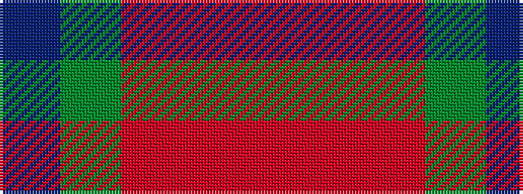

BGRRR

It is a 5 stripe tartan.

<figure class="pat-woven">

<figcaption>idealised sample</figcaption>
</figure>

## Colour Sequence



## Tartans with this colour sequence

| Tartans |
|---------------|
| [Highland Princess, The](/variants/s5/b15g15o11r17m15~x2/)|
||
| [Lloyd of Wales](/variants/s5/o40r2o20g19db2/)|
||
