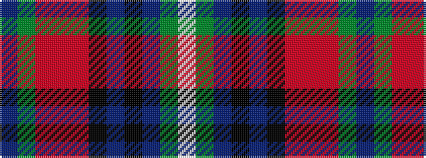

BGRRRKBKBGW

It is a 11 stripe tartan.

<figure class="pat-woven">

<figcaption>idealised sample</figcaption>
</figure>

## Colour Sequence



## Tartans with this colour sequence

| Tartans |
|---------------|
| [1314 (Corporate)](/variants/s11/db10g6o4r2o4k10db6k4db28g55w4/)|
||
