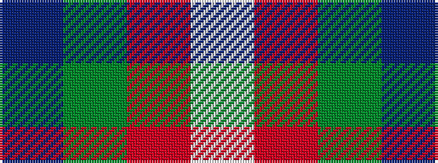

BGRW

It is a 4 stripe tartan.

<figure class="pat-woven">

<figcaption>idealised sample</figcaption>
</figure>

## Colour Sequence



## Tartans with this colour sequence

| Tartans |
|---------------|
| [Harbison (2015)](/setts/s4/db21g34r14w6~x2/)|
||
| [Thorntons Law (Corporate)](/setts/s4/db10g10r5w1~x2/)|
||
| [Wilson's No.189](/setts/s4/dp4g10r1w1~x2/)|
||
