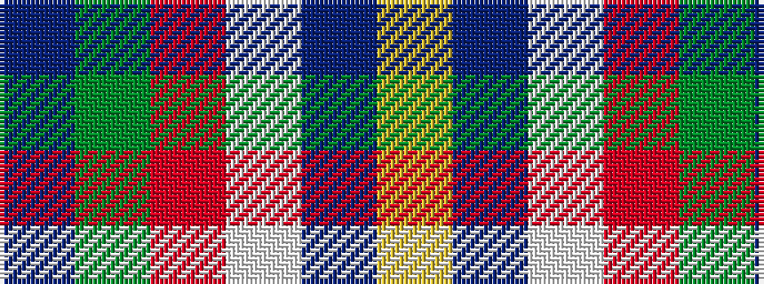

BGRWBY

It is a 6 stripe tartan.

<figure class="pat-woven">

<figcaption>idealised sample</figcaption>
</figure>

## Colour Sequence



## Tartans with this colour sequence

| Tartans |
|---------------|
| [Palazzo Bloise (Personal)](/setts/s6/db74g54r44w2p15ly10/)|
||
| [Palazzo Bloise (Personal)](/setts/s6/db37g27r22w1dp6ly5~x2/)|
||
