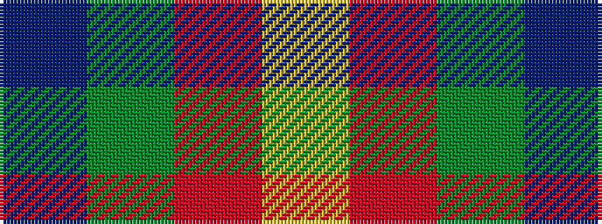

BGRY

It is a 4 stripe tartan.

<figure class="pat-woven">

<figcaption>idealised sample</figcaption>
</figure>

## Colour Sequence



## Tartans with this colour sequence

| Tartans |
|---------------|
| [Hirstwood (Name)](/variants/s4/lo28r24dg55dp19~x2/)|
||
| [Wilson's No.192](/variants/s4/dp4g10r1ly1~x2/)|
||
| [Wilson's, No 192](/variants/s4/p4g10r1ly1~x2/)|
||
