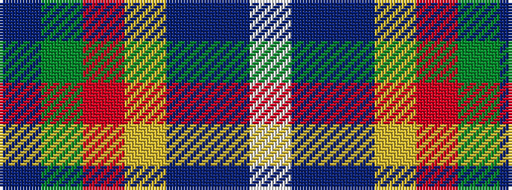

BGRYBBW

It is a 7 stripe tartan.

<figure class="pat-woven">

<figcaption>idealised sample</figcaption>
</figure>

## Colour Sequence



## Tartans with this colour sequence

| Tartans |
|---------------|
| [Ellan Vannin (1958)](/variants/s7/dp2dg8r1lo1db4dbi16lb1~x4/)|
||
| [Manx National](/variants/s7/b5dg9o2ly2db6t14w3~x4/)|
||
| [Manx National #2](/variants/s7/dp8dg31r4lo4db17b64w4/)|
||
| [Manx National District Tartan](/variants/s7/dp2g8r1ly1db6t15w1~x4/)|
||
| [Manx National District Tartan](/variants/s7/dp2g6r1ly1db3t10w1~x2/)|
||
