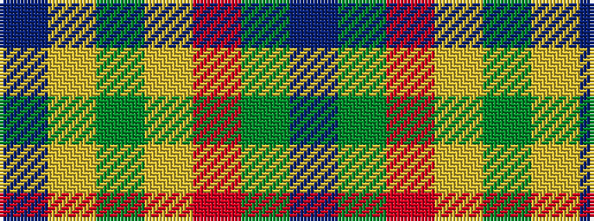

BGRYGYB

It is a 7 stripe tartan.

<figure class="pat-woven">

<figcaption>idealised sample</figcaption>
</figure>

## Colour Sequence



## Tartans with this colour sequence

| Tartans |
|---------------|
| [Supporter.com](/setts/s7/b120g9r7ly12g33ly33b26/)|
||
| [Supporter.com](/setts/s7/t60g9r7ly12g33ly33t26/)|
||
