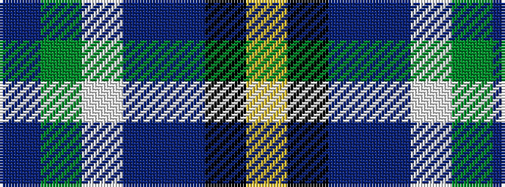

BGWBBKY

It is a 7 stripe tartan.

<figure class="pat-woven">

<figcaption>idealised sample</figcaption>
</figure>

## Colour Sequence



## Tartans with this colour sequence

| Tartans |
|---------------|
| [Carmen Lau (Hong Kong) (Personal)](/setts/s7/ly8k3t2do1w6g12do2~x2/)|
||
