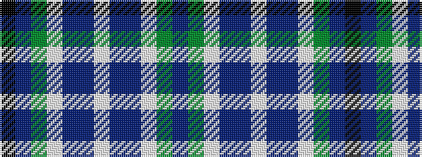

BGWBBWBBWGBK

It is a 12 stripe tartan.

<figure class="pat-woven">

<figcaption>idealised sample</figcaption>
</figure>

## Colour Sequence



## Tartans with this colour sequence

| Tartans |
|---------------|
| [Weisfeld](/variants/s12/k6dbi3g28w1db28dbi2w3~x2/)|
||
