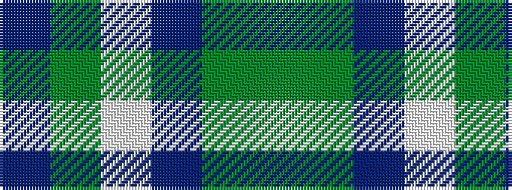

BGWBGG

It is a 6 stripe tartan.

<figure class="pat-woven">

<figcaption>idealised sample</figcaption>
</figure>

## Colour Sequence



## Tartans with this colour sequence

| Tartans |
|---------------|
| [Ellan Vannin](/setts/s6/g2g8dp4lb2g13b2~x4/)|
||
| [Manx, Ellan Vannin](/setts/s6/g2g7db3w2g14b2~x4/)|
||
