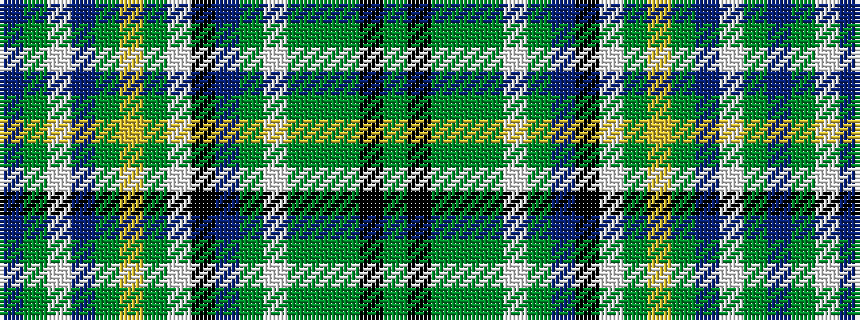

BGWBGYGWKBGWGGGKG

It is a 17 stripe tartan.

<figure class="pat-woven">

<figcaption>idealised sample</figcaption>
</figure>

## Colour Sequence



## Tartans with this colour sequence

| Tartans |
|---------------|
| [Les Cercles de Fermieres du Quebec](/variants/s17/dy16k4dy8g2dg19w2g22db15k4w3dg3ly4g30db25w5dg40db16~x2/)|
||
