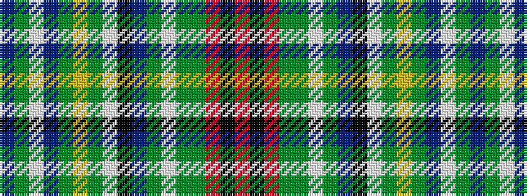

BGWBGYGWKBGWGGRKR

It is a 17 stripe tartan.

<figure class="pat-woven">

<figcaption>idealised sample</figcaption>
</figure>

## Colour Sequence



## Tartans with this colour sequence

| Tartans |
|---------------|
| [Les Cercles de Fermieres du Quebec](/setts/s17/db16dg40w5db25g30ly4dg3w3k4db15g22w2dg19g2o8k4o16~x2/)|
||
