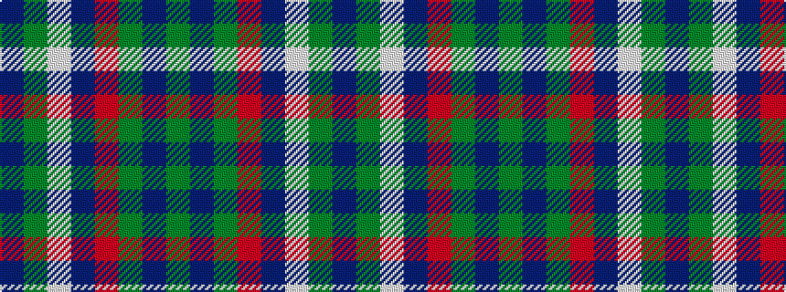

BGWBRGBG

It is a 8 stripe tartan.

<figure class="pat-woven">

<figcaption>idealised sample</figcaption>
</figure>

## Colour Sequence



## Tartans with this colour sequence

| Tartans |
|---------------|
| [British Columbia #2](/variants/s8/dg4dr14dg14o6dr1w30dg2dr1~x2/)|
||
| [Dogwood](/variants/s8/dg4do10dg10o6do1w26dg2do1~x4/)|
||
| [National Trust](/variants/s8/dg2dr8dg8o3dr1w12dg2dr1~x2/)|
||
