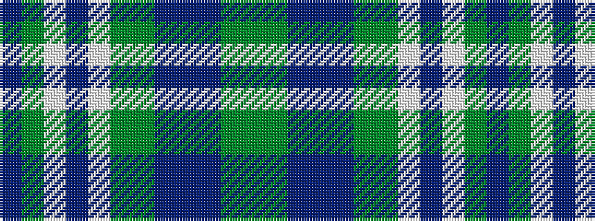

BGWBWGGBBBGG

It is a 12 stripe tartan.

<figure class="pat-woven">

<figcaption>idealised sample</figcaption>
</figure>

## Colour Sequence



## Tartans with this colour sequence

| Tartans |
|---------------|
| [Scottish Parliament (Official)](/variants/s12/yi45y3dt7dr2dt7y3yi4w2do36w2yi11dt4/)|
||
