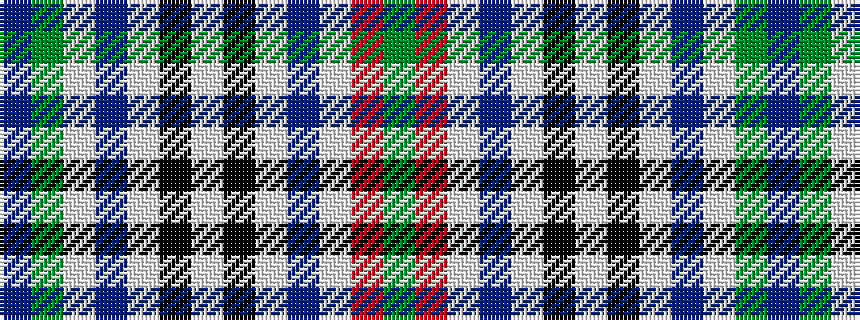

BGWBWKWKWBWRG

It is a 13 stripe tartan.

<figure class="pat-woven">

<figcaption>idealised sample</figcaption>
</figure>

## Colour Sequence



## Tartans with this colour sequence

| Tartans |
|---------------|
| [Gibbs/Gibson](/setts/s13/dg1r16w1db2w2k4w2k4w2db2w1dg16t1~x4/)|
||
