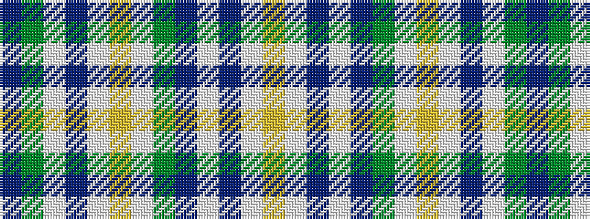

BGWBWYWGBWBWY

It is a 13 stripe tartan.

<figure class="pat-woven">

<figcaption>idealised sample</figcaption>
</figure>

## Colour Sequence



## Tartans with this colour sequence

| Tartans |
|---------------|
| [Entrelacs](/setts/s13/t14dg4w4t1w2lo2w2dg12t4w2t2w2lo1~x4/)|
||
| [Entrelacs (District)](/setts/s13/t14g4w4t1w2lo2w2g12t4w2t2w2lo1~x4/)|
||
