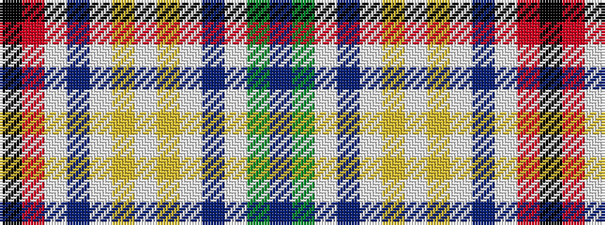

BGWBWYWYWBWRK

It is a 13 stripe tartan.

<figure class="pat-woven">

<figcaption>idealised sample</figcaption>
</figure>

## Colour Sequence



## Tartans with this colour sequence

| Tartans |
|---------------|
| [Gibbs, Gibson](/variants/s13/k2r16w1db2w1ly3w2ly3w1db2w1g16t2~x2/)|
||
