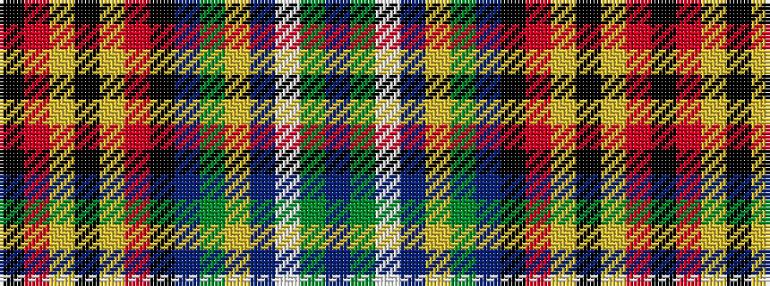

BGWBYGBKRYKYRK

It is a 14 stripe tartan.

<figure class="pat-woven">

<figcaption>idealised sample</figcaption>
</figure>

## Colour Sequence



## Tartans with this colour sequence

| Tartans |
|---------------|
| [Abel (2015)](/variants/s14/db22g22w6db4ly7g20db24k20r2lr24k6lr24r2k20~x2/)|
||
