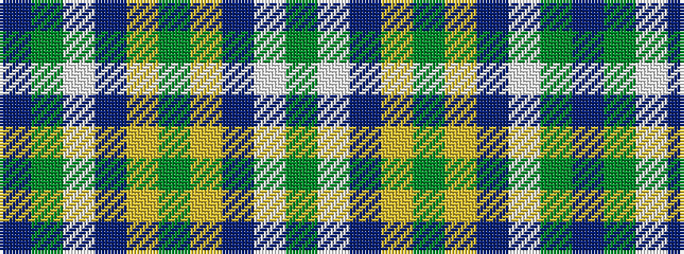

BGWBYGYBWG

It is a 10 stripe tartan.

<figure class="pat-woven">

<figcaption>idealised sample</figcaption>
</figure>

## Colour Sequence



## Tartans with this colour sequence

| Tartans |
|---------------|
| [Manx Ellan Vannin](/variants/s10/dg14w2db3lg7dg2lg7db3w2dg14t2~x4/)|
||
