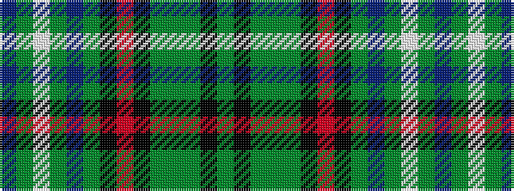

BGWGBGKRKGGGKG

It is a 14 stripe tartan.

<figure class="pat-woven">

<figcaption>idealised sample</figcaption>
</figure>

## Colour Sequence



## Tartans with this colour sequence

| Tartans |
|---------------|
| [Williams Arbutus (Personal)](/variants/s14/dg10k13dg10dy2dg7k5r2k6dg7db8dg3w1dg3b1~x2/)|
||
| [Williams Arbutus (Personal)](/variants/s14/g10k13g10dy2g7k5r2k6g7db8g3w1g3t1~x2/)|
||
