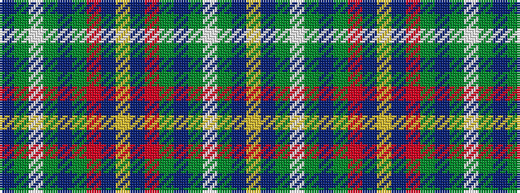

BGWGBGRBYBRGBGWGBY

It is a 18 stripe tartan.

<figure class="pat-woven">

<figcaption>idealised sample</figcaption>
</figure>

## Colour Sequence



## Tartans with this colour sequence

| Tartans |
|---------------|
| [Oxford University Dress](/setts/s18/db44g5w2g2db2g2r2db3ly3db3r2g2db2g2w2g5db44ly4~x2/)|
||
