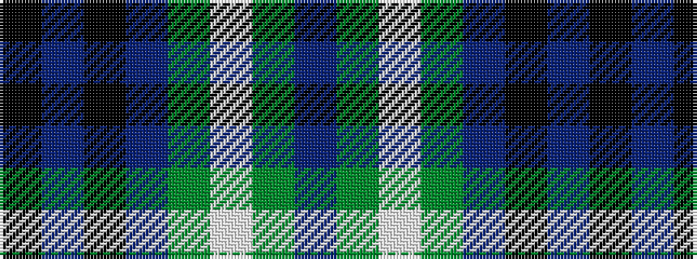

BGWGBKBK

It is a 8 stripe tartan.

<figure class="pat-woven">

<figcaption>idealised sample</figcaption>
</figure>

## Colour Sequence



## Tartans with this colour sequence

| Tartans |
|---------------|
| [SheBoom](/variants/s8/k35p2k3dp13g8w4g8dp8~x2/)|
||
