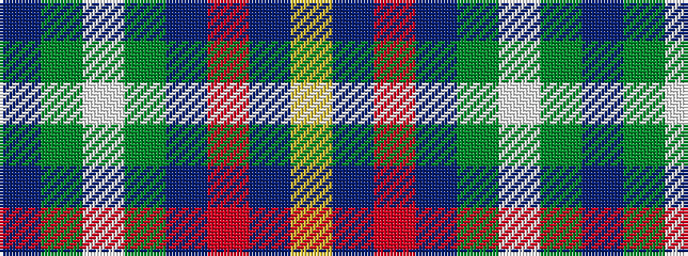

BGWGBRBY

It is a 8 stripe tartan.

<figure class="pat-woven">

<figcaption>idealised sample</figcaption>
</figure>

## Colour Sequence



## Tartans with this colour sequence

| Tartans |
|---------------|
| [United Services Planning Assoc Corporate Tartan](/variants/s8/dbi4dg2w2dg4db10r2db12ly3~x2/)|
||
| [United Services, Planning Association](/variants/s8/db4dg2w2dg4dbi10r2dbi12ly3~x2/)|
||
