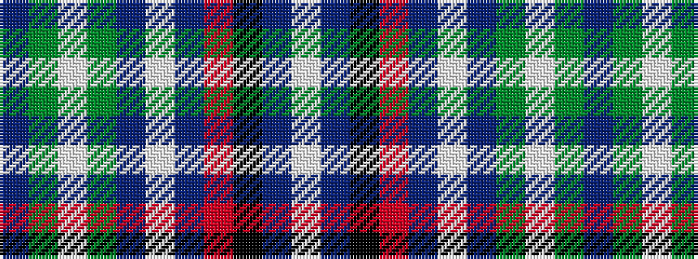

BGWGBWBRKBW

It is a 11 stripe tartan.

<figure class="pat-woven">

<figcaption>idealised sample</figcaption>
</figure>

## Colour Sequence



## Tartans with this colour sequence

| Tartans |
|---------------|
| [World Peace (Fashion)](/setts/s11/dp8g8w3g8dp8w3b40r3k3b40w3~x2/)|
||
