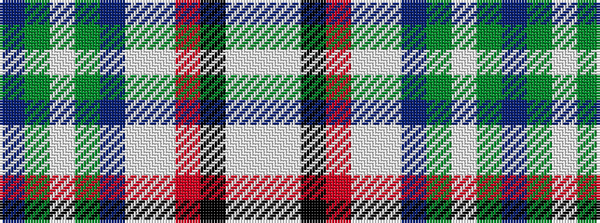

BGWGBWWRKWW

It is a 11 stripe tartan.

<figure class="pat-woven">

<figcaption>idealised sample</figcaption>
</figure>

## Colour Sequence



## Tartans with this colour sequence

| Tartans |
|---------------|
| [World Peace](/variants/s11/dp8dg8w3dg8dp8w3lb40r3k3lb40w3~x2/)|
||
