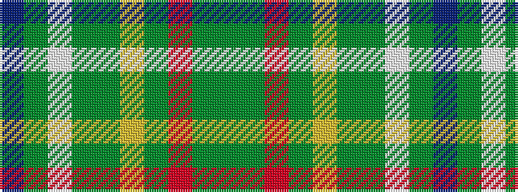

BGWGGYGRGG

It is a 10 stripe tartan.

<figure class="pat-woven">

<figcaption>idealised sample</figcaption>
</figure>

## Colour Sequence



## Tartans with this colour sequence

| Tartans |
|---------------|
| [Connecticut](/setts/s10/db20y2w1y5dg8ly1dg2r1dg8y16~x4/)|
||
