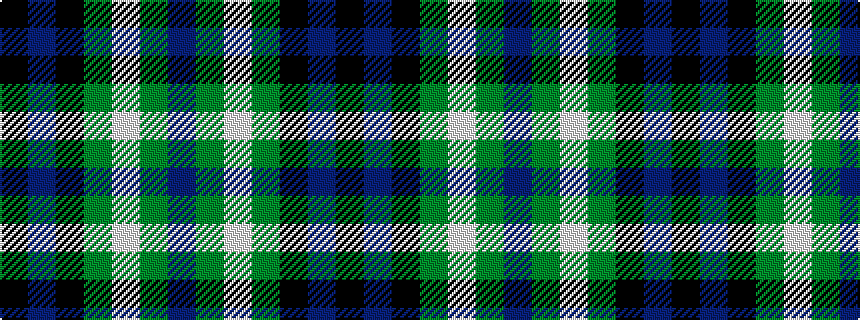

BGWGKBK

It is a 7 stripe tartan.

<figure class="pat-woven">

<figcaption>idealised sample</figcaption>
</figure>

## Colour Sequence



## Tartans with this colour sequence

| Tartans |
|---------------|
| [MacNeil of Colonsay](/setts/s7/db4dg6lb1dg6k6db6k2~x2/)|
||
| [MacNeil of Colonsay](/setts/s7/db4g6w1g6k6db6k2~x4/)|
||
| [MacNeil of Colonsay](/setts/s7/db4dg6w1dg6k6db6k2~x2/)|
||
| [MacNeil of Colonsay (Clan)](/setts/s7/db16g14w2g14k13db12k4~x2/)|
||
