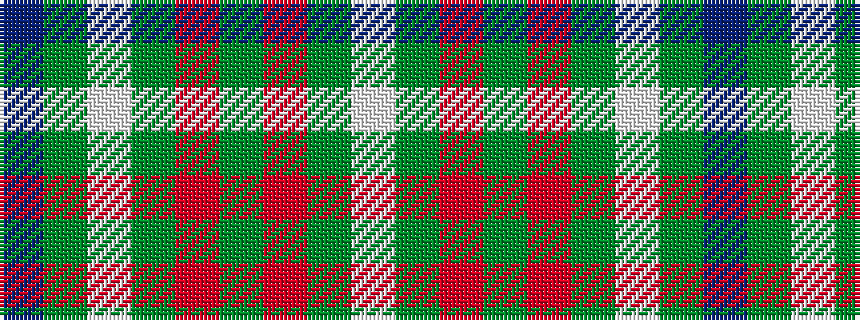

BGWGRGRGW

It is a 9 stripe tartan.

<figure class="pat-woven">

<figcaption>idealised sample</figcaption>
</figure>

## Colour Sequence



## Tartans with this colour sequence

| Tartans |
|---------------|
| [Cadenhead (2015)](/variants/s9/lb54dy4o4g12m4g8w1g8db6~x2/)|
||
