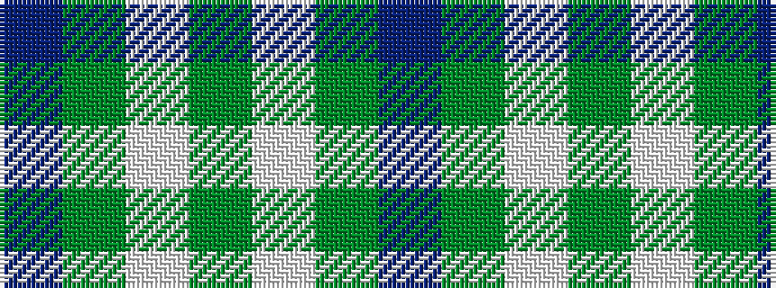

BGWGWGB

It is a 7 stripe tartan.

<figure class="pat-woven">

<figcaption>idealised sample</figcaption>
</figure>

## Colour Sequence



## Tartans with this colour sequence

| Tartans |
|---------------|
| [St Giles, Check](/variants/s7/db3y1w1y25w1y1p3~x2/)|
||
