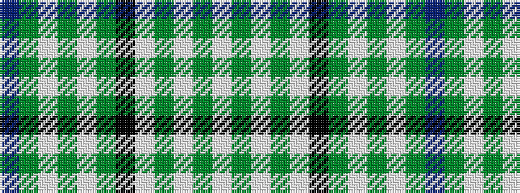

BGWGWGKWGWGW

It is a 12 stripe tartan.

<figure class="pat-woven">

<figcaption>idealised sample</figcaption>
</figure>

## Colour Sequence



## Tartans with this colour sequence

| Tartans |
|---------------|
| [Stephen-Mathieson (Name)](/setts/s12/lb16g1lb1g1lb1k12g1lb1g1lb1g6dp2~x4/)|
||
