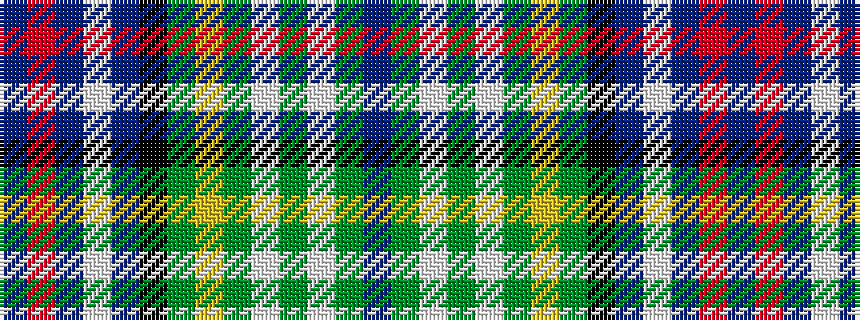

BGWGWGYGKBWBRB

It is a 14 stripe tartan.

<figure class="pat-woven">

<figcaption>idealised sample</figcaption>
</figure>

## Colour Sequence



## Tartans with this colour sequence

| Tartans |
|---------------|
| [Australian National](/setts/s14/db52g15w1g2w1g2ly2g2k2db3w2db2r2db5~x2/)|
||
