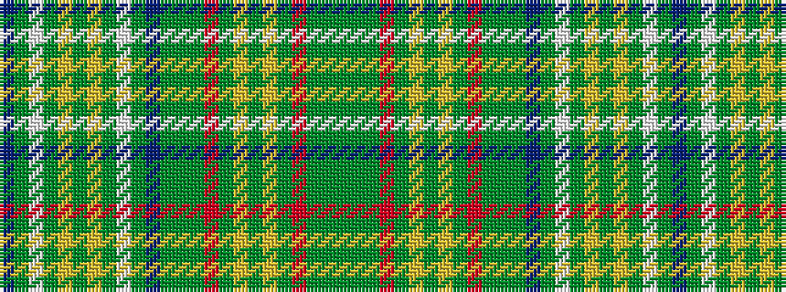

BGWGYGYGWGBGGGRGYGYGRGGG

It is a 24 stripe tartan.

<figure class="pat-woven">

<figcaption>idealised sample</figcaption>
</figure>

## Colour Sequence



## Tartans with this colour sequence

| Tartans |
|---------------|
| [Sea Bees Regimental Tartan Tartan Number: 2197. Earliest known date: 1986 US military unit. See products available Copyright © Blair Urquhart, Comrie, 2015](/setts/s24/db6g3lb6g7ly2g36ly2g7lb6g3db6g3dy6g3r6g7ly2g36ly2g7r6g3dy6g3~x2/)|
||
