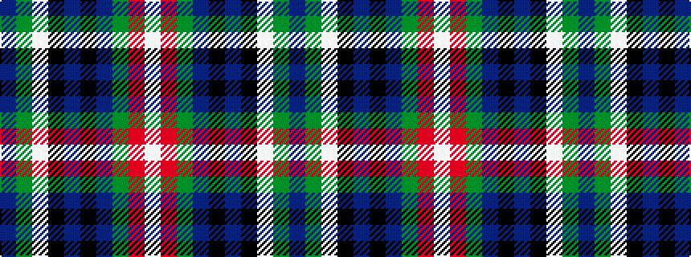

BGWKBKBGRW

It is a 10 stripe tartan.

<figure class="pat-woven">

<figcaption>idealised sample</figcaption>
</figure>

## Colour Sequence



## Tartans with this colour sequence

| Tartans |
|---------------|
| [Heart of Oak](/variants/s10/dp3g3w1k25db25k2db2g1r3w2~x2/)|
||
