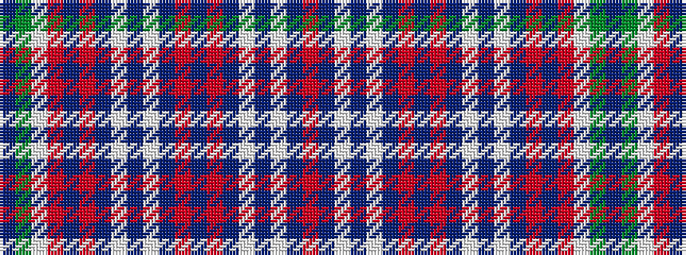

BGWRBRBWBWBRBRBWBWBR

It is a 20 stripe tartan.

<figure class="pat-woven">

<figcaption>idealised sample</figcaption>
</figure>

## Colour Sequence



## Tartans with this colour sequence

| Tartans |
|---------------|
| [Martha De Laurentiis](/setts/s20/db35g3w3r3db35r2db3w2db5w1db5r1db8r1db5w1db5w2db3r2~x2/)|
||
